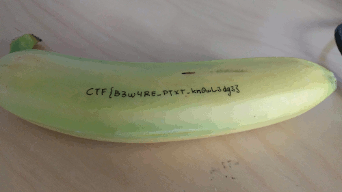

# Aarhus CTF 2019 - Repeated XOR 2: Electric Boogaloo
#### (Crypto, 499 Points, 2 Solves)
*By Team "[! leftovers](http://challenges.aarhus-ctf.dk/users/9)" (Sam Beresford & Emilie Bjerg)*

----
### Challenge Description:
We are being asked to decrypt a flag file that was encrypted using repeated XOR. A hint, about the length of the key being 10 bytes and the file being a 500x281 image, encourages us to start using image file signatures (The first few bytes of a file that help determine it's type) to obtain the key.

<p align="center">
  
</p>

----
### Solution

First we tried XORing the first few bytes of the file with known file signatures of common image file types.
```
Bitmap	- 0x42 0x4D ...
Jpeg	- 0xFF 0xD8 0xFF ...
Png	- 0x89 0x50 0x4E 0x47 0x0D ...
Gif87	- 0x47 0x49 0x46 0x38 0x37 0x61 ...
Gif89	- 0x47 0x49 0x46 0x38 0x39 0x61 ...
```
This gives us the following results:


From this we can see a Gif87 or Gif89 header gives an interesting result of *key=* something.

If we try extending on these Gif headers by adding the known height(500, 0x1F4) and width (281, 0x119) of the image, in little-endian format:
```
Gif87	- 0x47 0x49 0x46 0x38 0x37 0x61 0xF4, 0x01, 0x19, 0x01
Gif89	- '                 ' 0x39 0x61 0xF4, 0x01, 0x19, 0x01
```

After XOR these two we have a choice between these two keys:


Using the nicer looking key of *key=Banana* we can decrypt the file and get:



### Flag:
*CTF{B3w4RE_PTXT_knOwL3dg3}*

---
### Code used

```python
headers = [
  [0x42, 0x4D], # Bitmap
  [0xFF, 0xD8, 0xFF], # Jpeg
  [0x89, 0x50, 0x4E, 0x47], # Png
  [0x47, 0x49, 0x46, 0x38, 0x37, 0x61], #Gif87
  [0x47, 0x49, 0x46, 0x38, 0x39, 0x61] #Gif89
]
with open("flag.bin") as file:
  head = file.read(10)
  for i in range(0, len(headers)):
    output = ""
    for j in range(0, len(headers[i])):
      output += chr(ord(head[j]) ^ headers[i][j])
    print output

#Gif87 Header + Height (LSB) + Width (LSB)
header = [0x47, 0x49, 0x46, 0x38, 0x37, 0x61, 0xF4, 0x01, 0x19, 0x01]
key = []
with open("flag.bin") as file:
  head = file.read(10)
  for i in range(0, len(header)):
    key.append(chr(ord(head[i]) ^ header[i]))

print key

#Gif89 Header + Height (LSB) + Width (LSB)
header = [0x47, 0x49, 0x46, 0x38, 0x39, 0x61, 0xF4, 0x01, 0x19, 0x01]
key = []
with open("flag.bin") as file:
  head = file.read(10)
  for i in range(0, len(header)):
    key.append(chr(ord(head[i]) ^ header[i]))

print key

with open("flag.bin") as file:
 content = file.read()
 output = ""
 for i in range(0, len(content)):
  output += chr(ord(content[i]) ^ ord(key[i%len(key)]))

print output[:10]

with open("flag.gif", "w") as out:
  out.write(output)
```

# Challenge Solved!